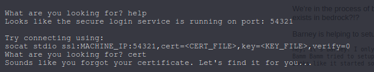
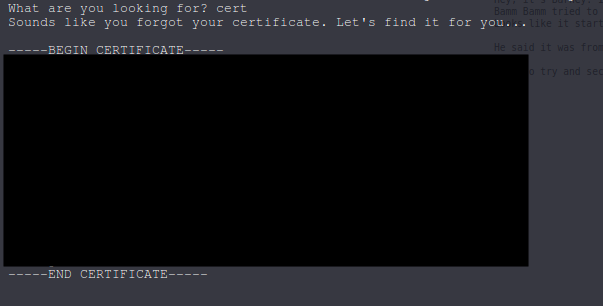
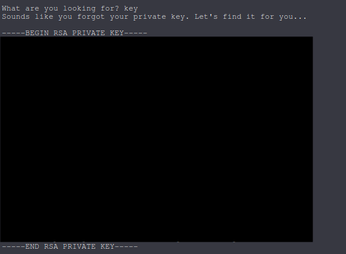
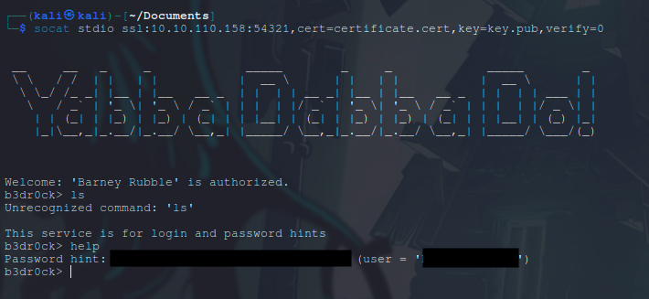

# TryHackMe - b3dr0ck

### Reconnaissance

1. Starting with port scan using rustscan

we see 4 open ports and a certificate.  
we don't know what to do with the certificate yet so let's just save it in a .cert file for later use.  

2. Visiting the webpage.  

we are getting redirected to port 4040 and it has a message for us.  
we definitely need that certificate from nmap scan.

3. Little bit more digging
My usual next move is to curl -v the page, searchsploit the version number, using feroxbuster  
and more but it was all just a waste of time.
I tried using nc to see if i can get something and voilah

  
we get some kind of pseudo shell.  
I tried few commands there and heres what i found.  

we can execute very few commands but the most important one was help.  
"help" gave us a command which requires a certificate and a key.  

  

Next i tried cert and key and we got exactly what we needed.  

  
it's exactly the same certificate we found in nmap scan.  

  

With this, we have everything we need for our next step.  

### Foothold

1. Executing the socat command we got from help menu we got another pseudo shell.  
let's see what we get from here.  

2. Type help and we got a password hint.  
Going with hit and trial on the ssh port with the aquired information.

  
