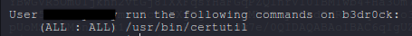
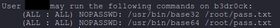

# TryHackMe - b3dr0ck

## Reconnaissance

1. Starting with port scan using rustscan

I see 4 open ports and a certificate.  
I don't know what to do with the certificate yet so let's save it in a .cert file for later use.  

2. Let's check the webpage.  

I am getting redirected to port 4040 and it has a message for us.  
I definitely need that certificate from nmap scan.

3. Little bit more digging.  

Usually my next move is to "curl -v" the page, "searchsploit" the version number, using "feroxbuster"  
and more but it was all just a waste of time except "nc".  
I tried using nc to see if i can get something and i was right to do so.

  
I get some kind of pseudo shell.  
I tried few commands there and heres what i found.  

we can execute very few commands but the most important one was "help".  
"help" gave me another command which requires a certificate and a key.  

  

Next i tried cert and key and i got exactly what i needed.  

  
it's exactly the same certificate i had found in nmap scan.  

  
With this, i have everything i need for our next step.  

## Foothold

1. Executing the socat command i got from help menu and i got another pseudo shell.  
Let's see what i get from here.  

2. Type help and it gave me a password hint.  

  

3. I tried ssh port with the aquired credentials and it worked.
I am in as "######".

## Privilege Escalation

1. The first thing i try is "sudo -l". I see that this user can use certutil as super user.  
Lets try using it and see what i can do.

2. I can use this to generate certificate and key for a user.  

So here is what i did.  
1. I read "/etc/passwd" file and found that there was another user.
2. I used "sudo certutil" to generate cert,key for that user.
3. I used the same "socat" command with these new cert and key file.
4. I got the same pseudo shell like before and i used "help" which gave me the ssh password for second user.

## Root

From here on things are easy  
1. I did "sudo -l" and saw something unusual

  

2. Going for the first one first.
3. using "sudo base64 filename" gave me a base64 encoded text.
4. Decoding it gave me another base32 encoded text
5. Again decoding it gave me a base64 encoded file.
6. After final base64 decode i got a hash.
7. Using hash-identifier for the last one shows that it is a md5 hash.
8. Using crackstation for this one and i got the root password.
9. "su root" enter the password and i rooted the machine.😁