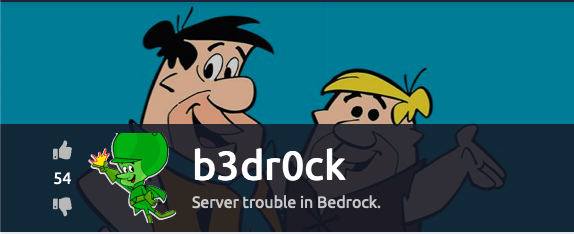
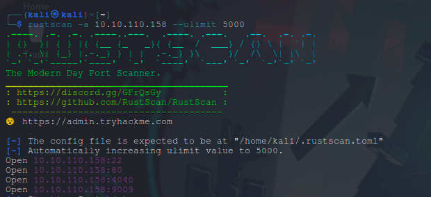
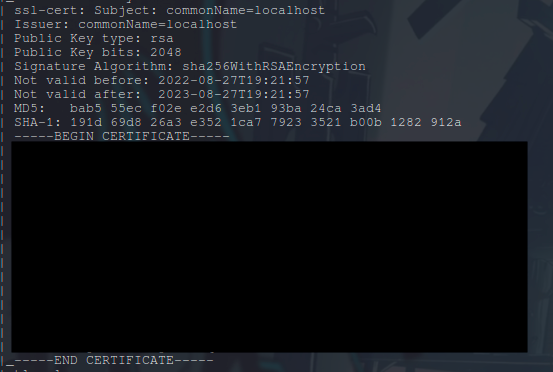
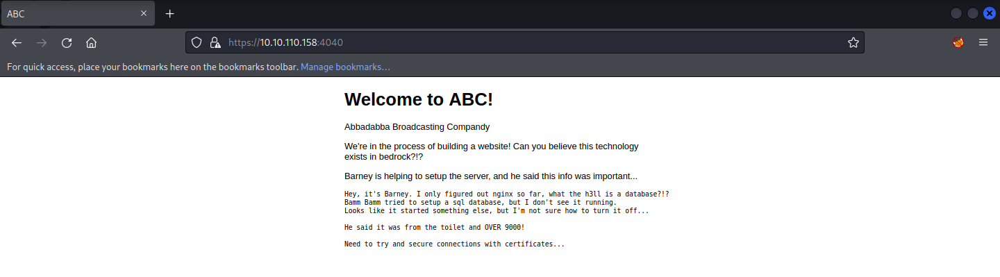
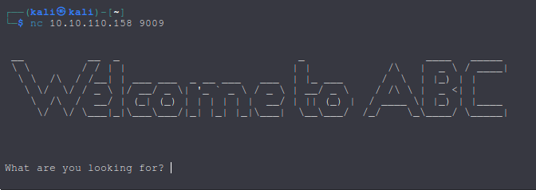

# TryHackMe - b3dr0ck

### Reconnaissance

1. Starting with port scan using rustscan

we see 4 open ports and a certificate.  
we don't know what to do with the certificate yet so let's just save it in a .cert file for later use.  

2. Visiting the webpage.  

we are getting redirected to port 4040 and it has a message for us.  
we definitely need that certificate from nmap scan.

3. Little bit more digging
My usual next move is to curl -v the page, searchsploit the version number, using feroxbuster  
and more but it was all just a waste of time.
I tried using nc to see if i can get something and voilah

  
we get some kind of pseudo shell.  
I tried few commands there and heres what i found.